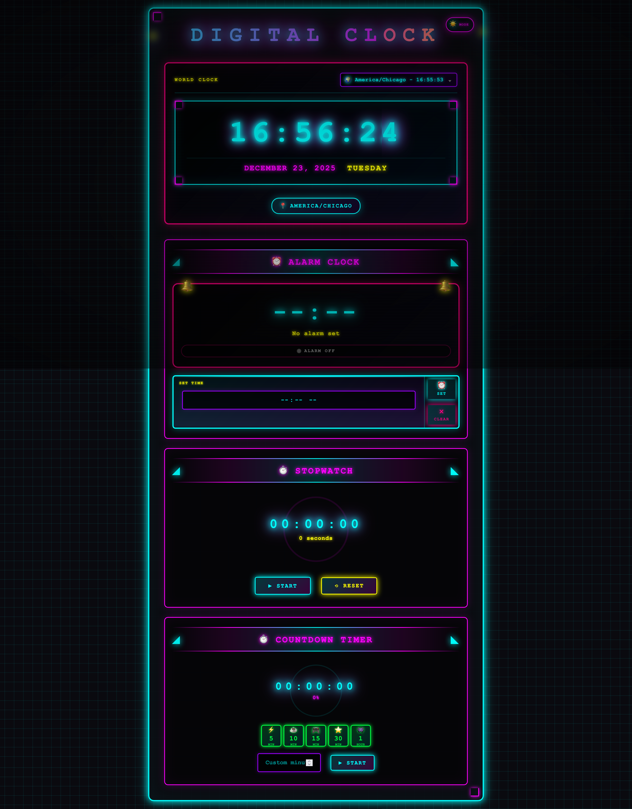
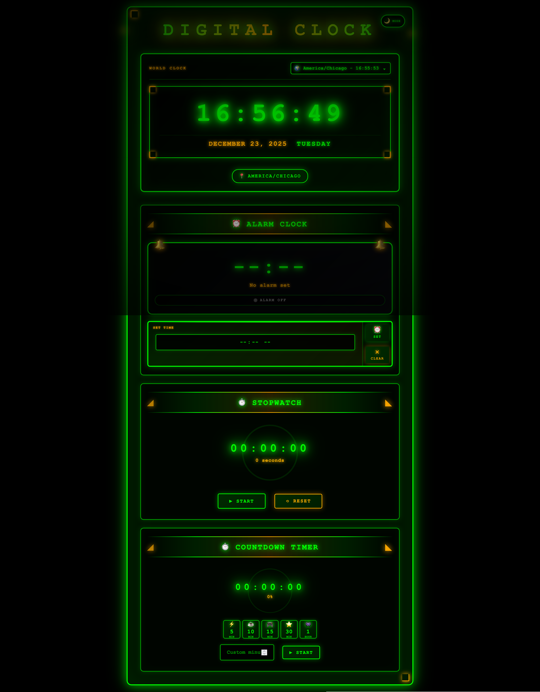
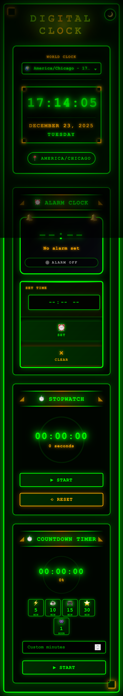

# Digital Clock

A feature-rich web-based digital clock application built with Spring Boot and vanilla JavaScript, featuring a stunning **retro 80s/90s arcade aesthetic**. This application provides a world clock with timezone support, alarm functionality, stopwatch, and countdown timer, all wrapped in nostalgic neon visuals.

## 🚀 Live Demo

**[View Live Application](https://retro-clock.onrender.com)**

*Note: Hosted on Render's free tier - initial load may take 30-60 seconds as the service spins up.*

## 📸 Screenshots

### Light Mode - Neon Arcade Aesthetic

*Vibrant 80s/90s arcade style with cyan, magenta, pink, and yellow neon colors*

### Dark Mode - Classic CRT Terminal

*Authentic 1970s-80s terminal green phosphor display with amber accents*

### Mobile Responsive Design

*Fully responsive layout optimized for mobile devices*

## Features

### 1. World Clock
- Real-time digital clock display (HH:mm:ss format)
- Current date and day of the week
- Timezone selector with search functionality
- Support for all global timezones
- Automatic timezone detection

### 2. Alarm
- Set alarms for specific times
- Timezone-aware alarm system
- Audio notification using Web Audio API
- Visual alert notifications
- Displays active alarm with timezone information
- **Persistent storage** - Alarms survive page refreshes using localStorage
- Cancel alarm functionality

### 3. Stopwatch
- Precise time tracking in HH:mm:ss format
- Start/Stop toggle functionality
- Reset capability
- **Persistent storage** - State survives page refreshes using localStorage
- Automatically resumes if running when page was closed
- Accounts for elapsed time during page closure

### 4. Countdown Timer
- Set custom timer duration in minutes
- **Quick Presets**: 5min, 10min, 15min, 30min, 1hr buttons for instant setup
- Visual countdown display
- Start/Stop toggle
- Alert notification when timer completes
- **Persistent storage** - Timer state survives page refreshes using localStorage
- Automatically resumes countdown if running when page was closed
- Accounts for elapsed time during page closure
- Triggers completion alert if timer finished while page was closed

### 5. Dark Mode
- Toggle between light and dark themes
- **Light Mode**: Colorful neon 80s arcade style with cyan, magenta, pink, yellow
- **Dark Mode**: Classic green CRT terminal aesthetic (Matrix-style phosphor green)
- Smooth transitions between themes
- **Persistent preference** - Theme choice saved to localStorage
- Affects all UI elements including dropdowns
- Accessible toggle button with theme icons

## Design & Aesthetics

### Retro 80s/90s Theme
The application features a meticulously crafted retro digital aesthetic that captures the essence of 1980s-90s arcade games and computer terminals:

#### Light Mode - Neon Arcade
- **Vibrant Neon Colors**: Cyan (#00ffff), Magenta (#ff00ff), Pink (#ff0080), Yellow (#ffff00), Purple (#9d00ff), Green (#00ff41)
- **Animated Grid Background**: Moving retro grid pattern reminiscent of Tron and arcade games
- **CRT Screen Effects**: Scanline overlay and vignette for authentic monitor appearance
- **Neon Glow**: All text and borders feature pulsing neon glow effects
- **Arcade-Style Buttons**: Buttons with ripple effects and neon shadows
- **Monospace Fonts**: Courier New/Consolas for that authentic digital terminal look
- **Corner Decorations**: Magenta corner accents on the main container
- **Floating Animations**: Section headers with playful floating arrow indicators

#### Dark Mode - Classic CRT Terminal
- **Phosphor Green**: Everything rendered in classic terminal green (#00ff00)
- **Amber Accents**: Secondary elements in warm amber (#ffaa00) for contrast
- **Pure Black Background**: No grid animation, just pure black like old monitors
- **Enhanced Scanlines**: Stronger CRT monitor scanline effect
- **Screen Flicker**: Subtle flicker animation on title text for authenticity
- **Phosphor Glow**: All text has that characteristic green phosphor glow
- **Terminal Pulse**: Clock display pulses like old terminal cursors
- **Stronger Vignette**: Dark edges simulating curved CRT screens
- **No Color**: Monochrome green aesthetic like 1970s-80s computer terminals

### Visual Effects
- **Neon Pulse Animation**: Text shadows that pulse and glow
- **Grid Movement**: Animated background grid (light mode only)
- **Scanlines**: Horizontal lines simulating CRT displays
- **Vignette**: Darkened edges for depth and CRT authenticity
- **Glitch Effect**: Subtle glitch animations (reserved for future enhancements)
- **Float Animation**: Playful floating elements
- **Button Ripples**: Expanding circle effect on button hover
- **Smooth Transitions**: All state changes animated smoothly

## Technologies Used

### Backend
- **Java 17**
- **Spring Boot 3.3.2**
  - Spring Web
  - Spring Boot DevTools
  - Thymeleaf Template Engine
- **Maven** - Dependency management and build tool

### Frontend
- **HTML5** - Semantic markup
- **CSS3** - Responsive styling with Flexbox
- **JavaScript (ES6+)** - Core functionality
- **jQuery 3.6.0** - DOM manipulation
- **Moment.js 2.29.1** - Date/time handling
- **Moment Timezone 0.5.33** - Timezone conversions
- **Select2 4.0.13** - Enhanced timezone dropdown with search
- **Web Audio API** - Alarm sound generation

## Prerequisites

- Java 17 or higher
- Maven 3.6+ (or use included Maven wrapper)
- Modern web browser (Chrome, Firefox, Safari, Edge)

## Installation & Setup

### 1. Clone the repository
```bash
git clone https://github.com/yourusername/retro-clock.git
cd retro-clock
```

### 2. Build the project
```bash
# Using Maven wrapper (recommended)
./mvnw clean install

# Or using system Maven
mvn clean install
```

### 3. Run the application
```bash
# Using Maven wrapper
./mvnw spring-boot:run

# Or using system Maven
mvn spring-boot:run

# Or run the JAR directly
java -jar target/digitalclock-0.0.1-SNAPSHOT.jar
```

### 4. Access the application
Open your web browser and navigate to:
```
http://localhost:8080
```

## Usage Guide

### Setting the Timezone
1. Click on the timezone dropdown at the top of the clock
2. Search for your desired timezone (e.g., "America/New_York", "Asia/Tokyo")
3. Select the timezone from the dropdown
4. The clock will automatically update to display time in the selected timezone

### Setting an Alarm
1. Navigate to the "Alarm" section
2. Click on the time input field
3. Select your desired alarm time
4. Click "Set Alarm" button
5. A confirmation message will appear showing the alarm time and timezone
6. The alarm is automatically saved and will persist even if you close the browser
7. Click "Cancel Alarm" to clear an active alarm
8. When the alarm triggers, you'll hear a beep sound and see an alert

### Using the Stopwatch
1. Navigate to the "Stopwatch" section
2. Click "Start Stopwatch" to begin timing
3. Click "Stop Stopwatch" to pause
4. Click "Start Stopwatch" again to resume
5. Click "Reset Stopwatch" to clear and start over
6. Your stopwatch state is automatically saved - it will resume even if you close the browser
7. If running when you close the page, it accounts for elapsed time when you return

### Using the Timer
1. Navigate to the "Timer" section
2. **Quick Start**: Click one of the preset buttons (5min, 10min, 15min, 30min, 1hr) for instant setup
   - OR manually enter the duration in minutes in the input field
3. Click "Start Timer" to begin countdown
4. Click "Stop Timer" to pause
5. Click "Start Timer" again to resume
6. Your timer state is automatically saved - it continues even if you close the browser
7. If the timer finishes while the page is closed, you'll see the completion alert when you return
8. An alert will notify you when the timer completes

### Toggling Dark Mode
1. Click the theme toggle button in the top-right corner of the clock container
2. The interface will switch between two distinct retro themes:
   - **Light Mode**: Vibrant neon arcade with colorful cyan, magenta, pink, and yellow
   - **Dark Mode**: Classic green CRT terminal with phosphor green glow (Matrix-style)
3. Your preference is automatically saved and will be remembered on future visits
4. Light mode shows a sun icon (☀️), dark mode shows a moon icon (🌙)

## Project Structure

```
retro-clock/
├── src/
│   ├── main/
│   │   ├── java/com/example/digitalclock/
│   │   │   ├── DigitalClockApplication.java    # Main application class
│   │   │   ├── controller/
│   │   │   │   └── ClockController.java        # Web controller
│   │   │   └── service/
│   │   │       └── ClockService.java           # Business logic
│   │   └── resources/
│   │       ├── application.properties           # Application configuration
│   │       ├── templates/
│   │       │   └── index.html                  # Main HTML template
│   │       └── static/
│   │           ├── css/
│   │           │   └── styles.css              # Styling
│   │           └── js/
│   │               └── clock.js                # JavaScript functionality
│   └── test/
│       └── java/com/example/digitalclock/
│           └── DigitalClockApplicationTests.java
├── screenshots/                                 # Application screenshots
├── pom.xml                                      # Maven dependencies
├── Dockerfile                                   # Docker configuration
└── README.md                                    # Documentation
```

## Configuration

The application uses default Spring Boot configuration. To customize:

### Change Server Port
Edit `src/main/resources/application.properties`:
```properties
server.port=8090
```

### Change Application Name
```properties
spring.application.name=my-digital-clock
```

## Browser Compatibility

- Chrome 90+
- Firefox 88+
- Safari 14+
- Edge 90+

Note: Web Audio API is required for alarm sounds and is supported in all modern browsers.

## Known Limitations

- Only one alarm can be active at a time
- Timer input is limited to minutes (no seconds)

## Future Enhancements

- Multiple alarm support with labels
- Custom alarm sounds upload
- Lap times for stopwatch
- Browser notifications API integration
- Progressive Web App (PWA) support
- User accounts and cloud sync
- Additional retro theme variants (amber monochrome, blue terminal, etc.)
- Customizable color schemes

## Development

### Running in Development Mode
Spring Boot DevTools is included, enabling hot reload:
```bash
./mvnw spring-boot:run
```

Changes to Java files, templates, and static resources will automatically reload.

### Running Tests
```bash
./mvnw test
```

## Contributing

Contributions are welcome! Please feel free to submit a Pull Request.

1. Fork the repository
2. Create your feature branch (`git checkout -b feature/AmazingFeature`)
3. Commit your changes (`git commit -m 'Add some AmazingFeature'`)
4. Push to the branch (`git push origin feature/AmazingFeature`)
5. Open a Pull Request

## License

This project is open source and available under the [MIT License](LICENSE).

## Author

Vidya Sagar

## Acknowledgments

- Spring Boot team for the excellent framework
- Moment.js team for timezone handling
- Select2 team for the enhanced dropdown component

## Support

If you encounter any issues or have questions, please file an issue on the GitHub repository.

---

Made with ❤️ using Spring Boot
